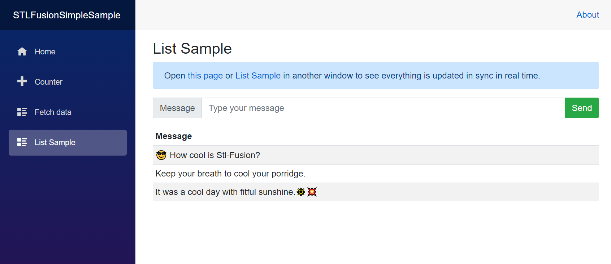
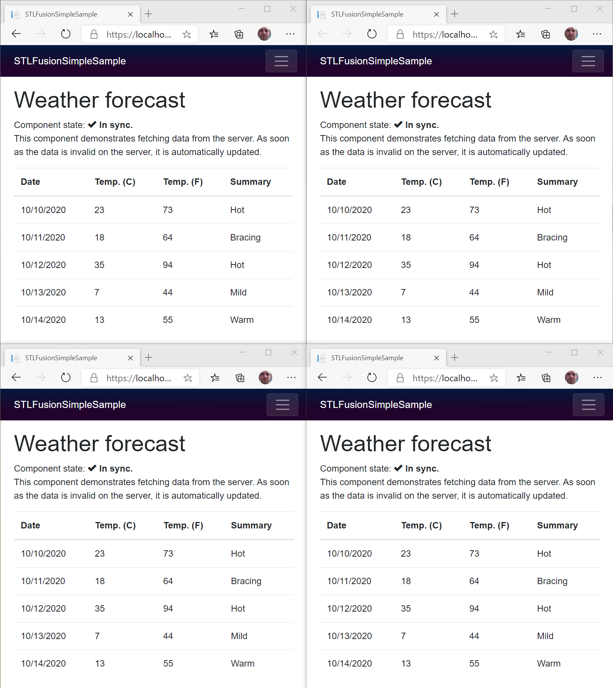

# STL Fusion Blazor WASM Sample

This sample shows how to use [STL Fusion](https://github.com/servicetitan/Stl.Fusion) with Blazor WASM hosted with  ASP.NET Core.

It is a very simplified version of the chat example from [Stl.Fusion.Samples](https://github.com/servicetitan/Stl.Fusion.Samples):

I also stl-fusionized the basic WeatherForecast Blazor sample:

